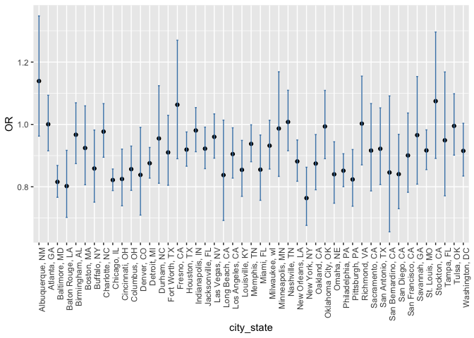
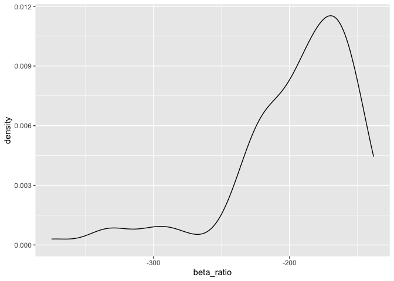
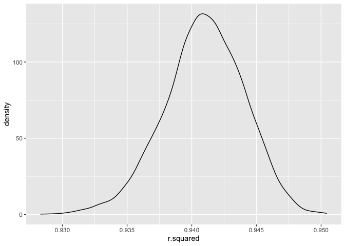
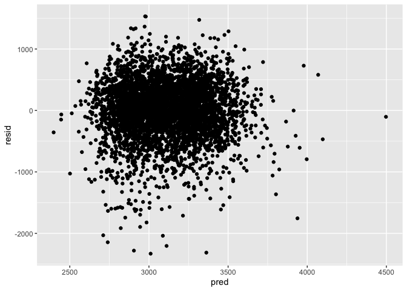

p8105_hw6_co2616
================
2025-12-01

loading key packages

``` r
library(tidyverse)
```

    ## ── Attaching core tidyverse packages ──────────────────────── tidyverse 2.0.0 ──
    ## ✔ dplyr     1.1.4     ✔ readr     2.1.5
    ## ✔ forcats   1.0.0     ✔ stringr   1.5.1
    ## ✔ ggplot2   3.5.2     ✔ tibble    3.3.0
    ## ✔ lubridate 1.9.4     ✔ tidyr     1.3.1
    ## ✔ purrr     1.1.0     
    ## ── Conflicts ────────────────────────────────────────── tidyverse_conflicts() ──
    ## ✖ dplyr::filter() masks stats::filter()
    ## ✖ dplyr::lag()    masks stats::lag()
    ## ℹ Use the conflicted package (<http://conflicted.r-lib.org/>) to force all conflicts to become errors

``` r
library(p8105.datasets)
```

## Problem 1

loading and cleaning homicide dataset

``` r
homicide_df = 
  read_csv("data/homicide_data.csv", na = c("NA", ".", "")) %>% 
  janitor::clean_names() %>%
  mutate(
    resolved = as.numeric(disposition == "Closed by arrest"),
    victim_age = as.numeric(victim_age)) %>% 
  unite("city_state", city, state, sep = ", " ) %>% 
  filter(
    !city_state %in% c("Dallas, TX", "Phoenix, AZ", "Kansas City, MO", "Tulsa, AL"),
    victim_race %in% c("White", "Black") 
        )
```

    ## Rows: 52179 Columns: 12
    ## ── Column specification ────────────────────────────────────────────────────────
    ## Delimiter: ","
    ## chr (9): uid, victim_last, victim_first, victim_race, victim_age, victim_sex...
    ## dbl (3): reported_date, lat, lon
    ## 
    ## ℹ Use `spec()` to retrieve the full column specification for this data.
    ## ℹ Specify the column types or set `show_col_types = FALSE` to quiet this message.

    ## Warning: There was 1 warning in `mutate()`.
    ## ℹ In argument: `victim_age = as.numeric(victim_age)`.
    ## Caused by warning:
    ## ! NAs introduced by coercion

note: case when function

**Baltimore, MD**

``` r
homicide_fit =
homicide_df %>% 
  filter(city_state == "Baltimore, MD") %>% 
  glm(resolved ~ victim_sex + victim_age + victim_race, family = binomial(),data = .)

homicide_fit %>%  
  broom::tidy() %>% 
  filter(term == "victim_sexMale") %>% 
  mutate(
    OR = exp(estimate),
    conf.low = exp(estimate - 1.96 * std.error),
    conf.high = exp(estimate + 1.96 * std.error)
    ) %>% 
  select(term, log_OR = estimate, OR, conf.low, conf.high) %>%  
  knitr::kable(digits = 3)
```

| term           | log_OR |    OR | conf.low | conf.high |
|:---------------|-------:|------:|---------:|----------:|
| victim_sexMale | -0.854 | 0.426 |    0.325 |     0.558 |

**All Cities**

``` r
city_glm = 
  homicide_df %>% 
  nest(data = -city_state) %>% 
  mutate(
    log_fit = map(data, \(df) glm(resolved ~ victim_sex + victim_age + victim_race, data = df)),
    results = map(log_fit, broom::tidy)) %>% 
  select(-data, -log_fit) %>%  
  unnest(results)

city_glm_results =
city_glm %>% 
  filter(term == "victim_sexMale") %>% 
  mutate(
   OR = exp(estimate),
   conf.low = exp(estimate - 1.96 * std.error),
   conf.high = exp(estimate + 1.96 * std.error)
    ) %>% 
  select(city_state, term, OR, conf.low, conf.high)
```

plotting results note: add comments

``` r
city_glm_results %>%
  mutate(
   city_state = fct_reorder(city_state, OR)
  ) %>% 
  ggplot(aes(x = city_state, y = OR)) +
  geom_point() +
  geom_errorbar(aes(ymin = conf.low, ymax = conf.high), width = 0.2, color = "steelblue") +
  theme(axis.text.x = element_text(angle = 90, hjust = 1, vjust = 1))
```

<!-- -->

## Problem 2

``` r
data("weather_df")
```

``` r
boot_sample = function(df) {
  
  sample_frac(df, size = 1, replace = TRUE)
}
```

``` r
boot_straps = 
  tibble(
    iter = 1:5000
  ) %>% 
  mutate(
    bootstrap_sample = map(iter, \(i) boot_sample(df = weather_df))
  )
```

``` r
bootstrap_results = 
  boot_straps %>% 
  mutate(
    models = map(bootstrap_sample, \(df) lm(tmax ~ tmin + prcp, data = df)),
    glance_results = map(models, broom::glance),
    tidy_results = map(models, broom::tidy)
    ) %>%  
  select(-bootstrap_sample, -models) %>%  
  unnest(glance_results) %>% 
  select(iter, r.squared, tidy_results) %>% 
  unnest(tidy_results) %>% 
  select(iter, r.squared, term, estimate) %>% 
  pivot_wider(
    names_from = term,
    values_from = estimate
  ) %>% 
  mutate(
    beta_ratio = tmin/prcp
  )
```

``` r
bootstrap_results %>% 
  ggplot(aes(x = beta_ratio)) +
  geom_density()
```

<!-- -->
note: add comments

``` r
bootstrap_results %>% 
  ggplot(aes(x = r.squared)) +
  geom_density()
```

<!-- -->
note: add comments

``` r
bootstrap_results %>% 
  select(iter, r.squared, beta_ratio) %>% 
 summarise(
   r_cis_lower = quantile(r.squared, 0.025),
   r_cis_upper = quantile(r.squared, 0.975),
   beta_cis_lower = quantile(beta_ratio, 0.025),
   beta_cis_upper = quantile(beta_ratio, 0.975),
 ) %>% 
  knitr::kable(digits = 3)
```

| r_cis_lower | r_cis_upper | beta_cis_lower | beta_cis_upper |
|------------:|------------:|---------------:|---------------:|
|       0.934 |       0.947 |       -276.522 |       -125.339 |

## Problem 3

loading and cleaning birthweight dataset

``` r
birth_df = 
  read_csv("data/birthweight.csv", na = c("NA", ".", "")) %>% 
  janitor::clean_names() %>% 
  mutate(
    babysex = case_match(
      babysex,
      1 ~ "male", 
      2 ~ "female"),
    malform = case_match(
      malform,
      0 ~ "absent", 
      1 ~ "present"),
    frace = case_match(
      frace,
      1 ~ "White",
      2 ~ "Black",
      3 ~ "Asian",
      4 ~ "Puerto Rican",
      8 ~ "Other",
      9 ~ "Unknown"
    ),
    mrace = case_match(
      mrace,
      1 ~ "White",
      2 ~ "Black",
      3 ~ "Asian",
      4 ~ "Puerto Rican",
    ),
  )
```

    ## Rows: 4342 Columns: 20
    ## ── Column specification ────────────────────────────────────────────────────────
    ## Delimiter: ","
    ## dbl (20): babysex, bhead, blength, bwt, delwt, fincome, frace, gaweeks, malf...
    ## 
    ## ℹ Use `spec()` to retrieve the full column specification for this data.
    ## ℹ Specify the column types or set `show_col_types = FALSE` to quiet this message.

This model is a multiple linear regression with `bwt` as the response
with `fincome`, `mrace`, `smoken` and `momage` as the predictors. My
hypothesized model is based off a 2015 scientific paper published in the
Archives of Medicen and Health Sciences exploring maternal determinants
influencing birth weight of newborn. The predictors I included in my
model are similar to the variables the authors of the paper studied.

``` r
model_1 = 
 lm(bwt ~ fincome + mrace + smoken + momage + delwt, data = birth_df)
```

plot of model residuals against fitted values

``` r
birth_df %>% 
modelr::add_residuals(model_1) %>%
modelr::add_predictions(model_1) %>% 
ggplot(aes(x = pred, y = resid)) +
geom_point()
```

<!-- -->
`model with`bwt`as the response with`blength`and`gaweeks\` as predictors
(main effects only)

``` r
model_1 = 
 lm(bwt ~ blength + gaweeks, data = birth_df)
```

model with`bwt` as the response with `bhead`, `blength`, `babysex` as
predictors and interactions

``` r
model_3 = 
 lm(bwt ~ bhead + blength + babysex + bhead*blength + bhead*babysex + blength*babysex + bhead*blength*babysex, data = birth_df)
```
